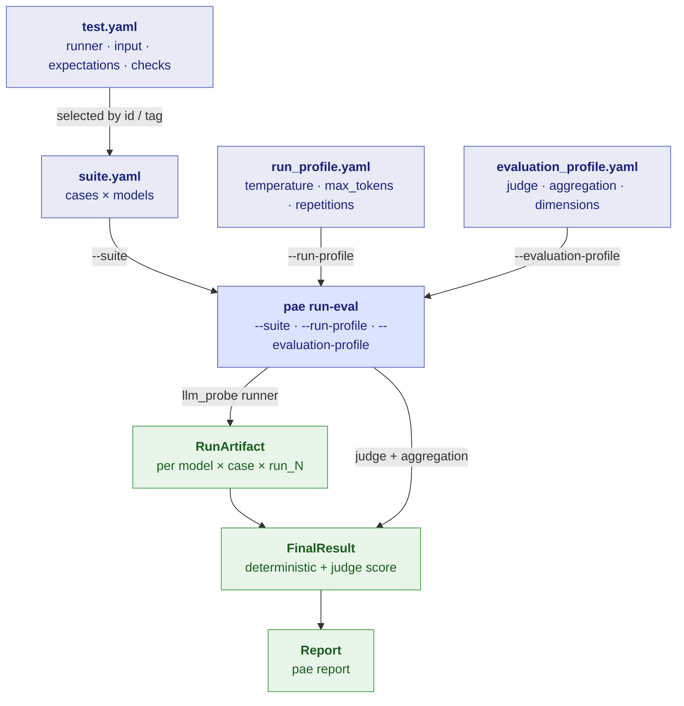

# Config Model

`personal_agent_eval` is driven by four YAML configuration types plus a reusable
OpenClaw agent directory. Each one answers a different question, and together they
define a complete benchmark **campaign**.

| Config type | File path | Answers |
|---|---|---|
| Test case | `configs/cases/<case_id>/test.yaml` | _What_ to test |
| Suite | `configs/suites/<suite_id>.yaml` | _Which_ cases and models |
| Run profile | `configs/run_profiles/<profile_id>.yaml` | _How_ to execute |
| Evaluation profile | `configs/evaluation_profiles/<profile_id>.yaml` | _How_ to judge |
| OpenClaw agent | `configs/agents/<agent_id>/agent.yaml` + `workspace/` | _Which reusable OpenClaw workspace_ |

---

## Relationships



---

## What each config controls

### `test.yaml` — the atomic test case

Defines one scenario in full isolation. The same case can be included in
multiple suites and run against multiple models without modification.

```yaml
schema_version: 1
case_id: h1_tool_chain
title: "H1 – Tool chain basic"
runner:
  type: llm_probe
input:
  messages:
    - role: user
      content: "Perform the task…"
expectations:
  hard_expectations:
    - text: "The response must include a confirmation"
  soft_expectations:
    - text: "The response is concise"
      weight: 0.5
deterministic_checks:
  - check_id: final-response-present
    dimensions:
      - process
    declarative:
      kind: final_response_present
```

Key fields: `runner`, `input.messages`, `input.attachments`,
`expectations.hard_expectations` / `expectations.soft_expectations`, `deterministic_checks`, `tags`.

For OpenClaw, the case schema stays the same. Use `runner.type: openclaw`, keep the task in
`input.messages`, and place any runner-specific hints under `input.context.openclaw`.

---

### `suite.yaml` — the campaign scope

Lists which cases and which models form the benchmark. A suite is **stable**:
adding new cases or repetitions expands the existing campaign directory
instead of creating a new one, as long as the `run_profile` is unchanged.

```yaml
schema_version: 1
suite_id: legacy_h1_h4_x7_h8
title: "Legacy evaluation suite"
cases:
  - h1_tool_chain
  - h4_email_constraints
  - x7_multiconstraint_planning
  - h8_complex_task
models:
  - model_id: minimax/minimax-01
  - model_id: openai/gpt-4o-mini
```

Key fields: `suite_id`, `cases`, `models`.

---

### `run_profile.yaml` — execution policy

Controls every aspect of how the runner calls the model. A semantic SHA-256
fingerprint of the effective execution identity is used to scope campaign
directories. Changing a field that affects reuse semantics produces a new
fingerprint and a new directory.

```yaml
schema_version: 1
run_profile_id: openrouter_minimax_smoke
runner_defaults:
  max_tokens: 4096
  temperature: 0.2
execution_policy:
  run_repetitions: 2        # stores run_1.json, run_2.json …
  timeout_seconds: 120
  max_retries: 2
```

Key fields: `runner_defaults`, `model_overrides`, `execution_policy.run_repetitions`.

For OpenClaw, `run_profile.yaml` also owns the dedicated runtime block:

```yaml
openclaw:
  agent_id: support_agent
  image: ghcr.io/openclaw/openclaw-base:0.1.0
  timeout_seconds: 300
```

That block selects the reusable agent directory and runtime image instead of relying on
free-form runner defaults.

---

### `configs/agents/<agent_id>/agent.yaml` — reusable OpenClaw agent

This is the fifth config surface introduced for OpenClaw. It is directory-based rather than
single-file based:

```text
configs/agents/support_agent/
  agent.yaml
  workspace/
    AGENTS.md
    SOUL.md
```

`agent.yaml` stores benchmark-owned OpenClaw fragments (`identity`, `agents_defaults`,
`agent`, `model_defaults`) and `workspace/` stores the reusable workspace template that will
be copied into each ephemeral run.

---

### `evaluation_profile.yaml` — judge policy

Defines one or more LLM judges, their prompts, the number of judge
repetitions, and how scores are aggregated into a final verdict.

```yaml
schema_version: 1
evaluation_profile_id: judge_gpt54
judge_system_prompt_path: prompts/judge_system_default.txt
judges:
  - name: primary_judge
    model_id: openai/gpt-5.4
    repetitions: 3
    aggregation: median
dimensions:
  task:
    policy: weighted
    judge_weight: 0.6
    deterministic_weight: 0.4
  autonomy:
    policy: judge_only
```

Key fields: `judges`, `dimensions`, `security_policy`, `anchors`.

---

## Campaign storage layout

Artifacts are stored under a deterministic path derived from the suite and
profile fingerprints. This allows incremental execution — only new
model/case/repetition combinations are computed.

```text
outputs/
├── charts/                              ← optional; CLI score/cost PNG (eval / run-eval / report)
│   └── {evaluation_profile_id}/
│       └── score_cost.png
├── runs/
│   └── suit_{suite_id}/
│       └── run_profile_{fp6}/
│           └── {model_id}/
│               └── {case_id}/
│                   ├── run_1.json
│                   └── run_2.json        ← when run_repetitions > 1
└── evaluations/
    └── suit_{suite_id}/
        └── evaluation_profile_{fp6}/
            └── eval_profile_{eval_id}_{fp6}/
                └── {model_id}/
                    └── {case_id}/
                        └── final_result_N.json
```

The chart is written by default when the optional `charts` dependency is installed; use
`--no-chart` to skip. See [Reporting](reporting.md).

!!! note "Fingerprints"
    `fp6` is the first 6 characters of the SHA-256 fingerprint of the
    profile's content. Modifying any execution or evaluation parameter
    produces a different fingerprint, creating a separate campaign directory
    and preserving the previous results.

!!! tip "Expanding a campaign"
    Adding a new case to a suite or increasing `run_repetitions` does **not**
    change the run profile fingerprint. The workflow detects which
    model/case/repetition combinations are missing and only runs those.

---

## CLI commands

```bash
# execute runs only
pae run --suite <id> --run-profile <id>

# evaluate existing runs
pae eval --suite <id> --run-profile <id> --evaluation-profile <id>

# run and evaluate in one shot
pae run-eval --suite <id> --run-profile <id> --evaluation-profile <id>

# render report from stored artifacts
pae report --suite <id> --run-profile <id> --evaluation-profile <id>
```

All flags accept either the plain config ID (auto-resolved from the
conventional directory) or an explicit YAML path.
