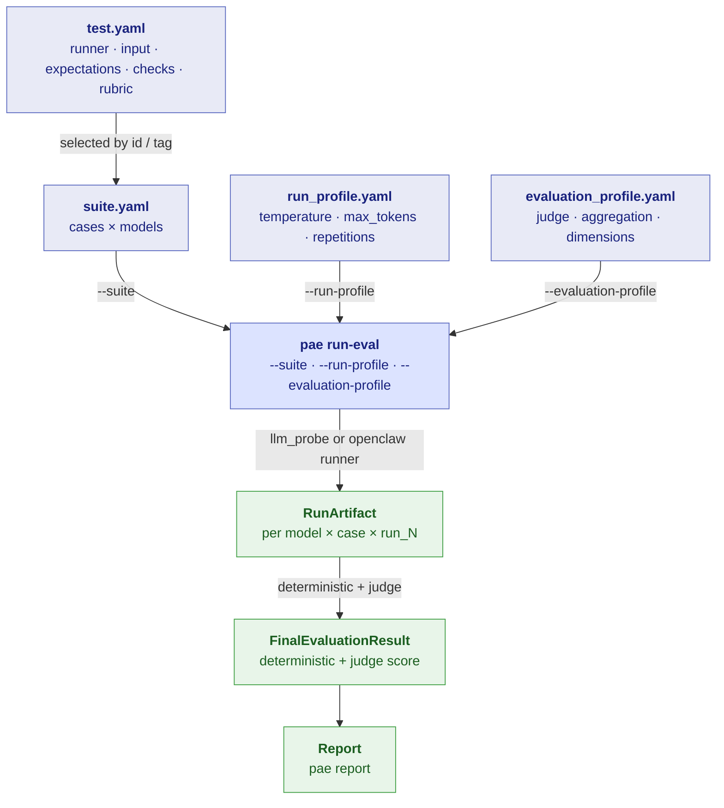
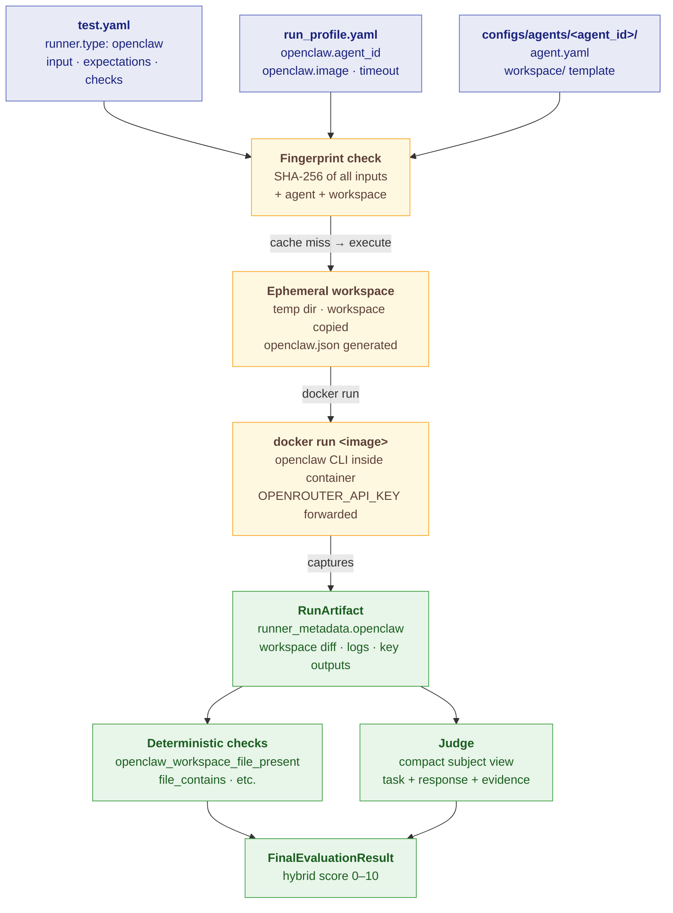
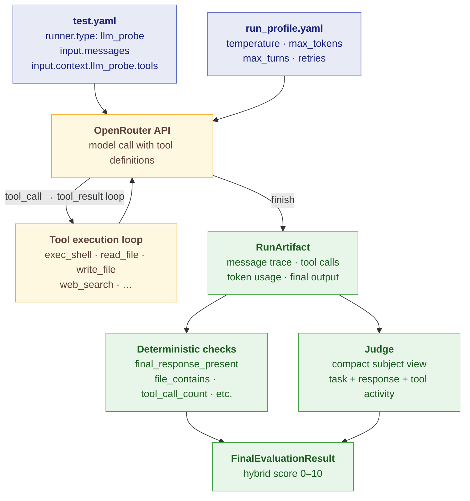

# Config Model

`personal_agent_eval` is driven by five YAML configuration surfaces. Each one answers a different question, and together they define a complete benchmark **campaign**.

| Config type | File path | Answers |
|---|---|---|
| Test case | `configs/cases/<case_id>/test.yaml` | _What_ to test |
| Suite | `configs/suites/<suite_id>.yaml` | _Which_ cases and models |
| Run profile | `configs/run_profiles/<profile_id>.yaml` | _How_ to execute |
| Evaluation profile | `configs/evaluation_profiles/<profile_id>.yaml` | _How_ to judge |
| OpenClaw agent | `configs/agents/<agent_id>/agent.yaml` + `workspace/` | _Which_ reusable agent workspace |

---

## How the four core configs relate



---

## OpenClaw execution flow

When a case uses `runner.type: openclaw`, two extra config surfaces come into play: the agent definition and the `openclaw:` block in the run profile.



---

## llm_probe execution flow

For `runner.type: llm_probe`, the runner calls OpenRouter directly and manages a tool-use loop until the model produces a final response or reaches `max_turns`.



---

## What each config controls

### `test.yaml` — the atomic test case

Defines one scenario in full isolation. The same case can be included in multiple suites and run against multiple models without modification.

```yaml
schema_version: 1
case_id: llm_probe_tool_example
title: "llm_probe tool example"
runner:
  type: llm_probe                 # or: openclaw
input:
  messages:
    - role: user
      content: |
        Use real tools to create a file...
  context:
    llm_probe:
      tools:
        - exec_shell
        - write_file
        - read_file
expectations:
  hard_expectations:
    - text: Uses tools to obtain the content instead of inventing it.
  soft_expectations:
    - text: Response is brief and clearly confirms the final file content.
rubric:
  version: 1
  scale:
    min: 0
    max: 10
    anchors:
      "10": All required steps completed; artifacts present; confirmation clear.
      "0": No attempt or irrelevant output.
  criteria:
    - name: Tool-grounded correctness
      what_good_looks_like: Uses required tools and reports observed results.
      what_bad_looks_like: Invents results or skips required steps.
deterministic_checks:
  - check_id: final-response-present
    dimensions: [task]
    declarative:
      kind: final_response_present
  - check_id: file-written
    dimensions: [process]
    declarative:
      kind: file_contains
      path: /tmp/expected_output.txt
      text: expected-marker
tags:
  - example
  - llm_probe
```

---

### `suite.yaml` — the campaign scope

Lists which cases and which models form the benchmark.

```yaml
schema_version: 1
suite_id: llm_probe_examples
title: "llm_probe runnable examples"
models:
  - model_id: minimax_m27
    requested_model: minimax/minimax-m2.7
    label: minimax/minimax-m2.7
case_selection:
  include_case_ids:
    - llm_probe_tool_example
    - llm_probe_browser_example
```

You can select cases by tag instead of (or in addition to) explicit IDs:

```yaml
case_selection:
  include_tags: [example]
  exclude_tags: [slow]
```

---

### `run_profile.yaml` — execution policy

Controls how the runner calls the model. A fingerprint of the effective execution settings scopes campaign directories.

```yaml
schema_version: 1
run_profile_id: llm_probe_examples
runner_defaults:
  temperature: 0
  timeout_seconds: 90
  max_tokens: 768
  max_turns: 6
  retries: 0
execution_policy:
  max_concurrency: 1
  run_repetitions: 1
  fail_fast: true
  stop_on_runner_error: true
```

For OpenClaw, add the `openclaw:` block:

```yaml
schema_version: 1
run_profile_id: openclaw_examples
openclaw:
  agent_id: basic_agent
  image: ghcr.io/openclaw/openclaw:2026.4.15
  timeout_seconds: 300
execution_policy:
  max_concurrency: 1
  run_repetitions: 1
  fail_fast: true
```

---

### `evaluation_profile.yaml` — judge policy

Defines one or more LLM judges, how repeated judge runs aggregate, and security controls.

```yaml
schema_version: 1
evaluation_profile_id: judge_gpt54
judges:
  - judge_id: gpt54_judge
    type: llm_probe
    model: openai/gpt-5.4-mini
judge_runs:
  - judge_run_id: gpt54_single
    judge_id: gpt54_judge
    repetitions: 1
aggregation:
  method: median
security_policy:
  allow_local_python_hooks: false
  redact_secrets: true
```

!!! note "final_score"
    `final_score` is the judge's holistic `overall.score` (0–10). Deterministic checks are preserved as supporting evidence for the judge and for debugging, but they do not compute the top-level score.

---

### `configs/agents/<agent_id>/` — reusable OpenClaw agent

```text
configs/agents/basic_agent/
  agent.yaml        ← agent identity, model defaults, sandbox settings
  workspace/
    AGENTS.md       ← workspace template (copied to every run)
    SOUL.md
```

---

## Campaign storage layout

```text
outputs/
├── charts/
│   └── {evaluation_profile_id}/
│       └── score_cost.png
├── runs/
│   └── suit_{suite_id}/
│       └── run_profile_{fp6}/
│           └── {model_id}/
│               └── {case_id}/
│                   ├── run_1.json
│                   ├── run_1.fingerprint_input.json
│                   └── run_2.json          ← when run_repetitions > 1
└── evaluations/
    └── suit_{suite_id}/
        └── evaluation_profile_{fp6}/
            └── eval_profile_{eval_id}_{fp6}/
                └── {model_id}/
                    └── {case_id}/
                        ├── evaluation_result_summary_1.md
                        ├── judge_1.prompt.debug.md
                        └── raw_outputs/
                            ├── final_result_1.json
                            ├── judge_1.json
                            └── judge_1.prompt.user.json
```

`fp6` is the first 6 characters of the SHA-256 fingerprint. → [Fingerprints & reuse](fingerprints.md)
